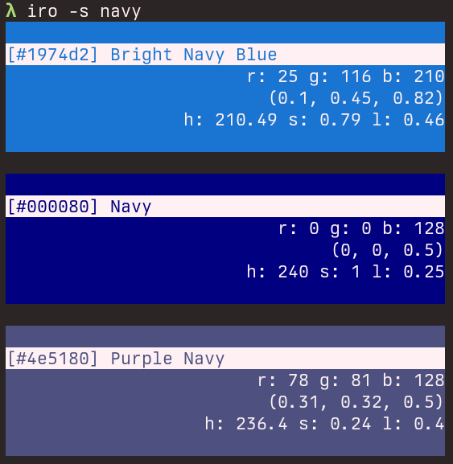
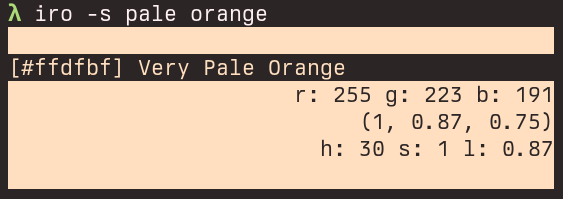

# iro -色-
   
A CLI tool to convert the hex color code, RGB or color name to color code, RGB, HSL, color name(if exists, according to [jonathantneal/color-names](https://github.com/jonathantneal/color-names)).

## Usage
`iro <hex color code>`  
`iro -r(--rgb) <r g b>`  
The color code do not need '#' at the beginning.

ex:  
`iro ffffff` or `iro 123456 333333`  
`iro -r 25 34 187` or `iro --rgb 0 0 255 120 120 240`

You can also search color name and print it.  
`iro -s(--search) <query>`

## Example

sample-1

sample-2

sample-3

sample-4

sample-5

## Motivation
When working on a GUI app launcher with [iced](https://iced.rs/), which is a really great framework, I was annoyed that it requires RGB tuples as 0.0 to 1.0. And of course there are a bunch of 'online converters' of the color code, but they do not work for me effectively because of the UI (they don't offer the 0-1 RGB converter, and we can't convert multiple color codes simultaneously). This is why I made this CLI app.
