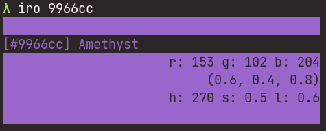
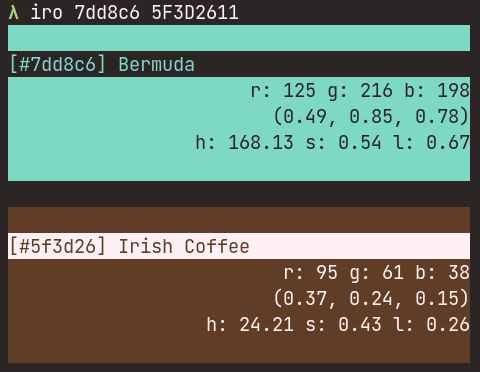

# iro -色-
   
Hex color code or RGB => color code, RGB, HSL, color name(if exists, according to [jonathantneal/color-names](https://github.com/jonathantneal/color-names)).

## Usage
`iro <hex color code>`  
`iro -r(--rgb) <r g b>`  
The color code do not need '#' at the beginning.

ex:  
`iro ffffff` or `iro 123456 333333`  
`iro -r 25 34 187` or `iro --rgb 0 0 255 120 120 240`

## Example

sample-1

sample-2

sample-3

## Motivation
When working on a GUI app launcher with [iced](https://iced.rs/), which is a really great framework, I was annoyed that it requires RGB tuples as 0.0 to 1.0. And of course there are bunch of 'online converters' of color code, but they all sucks because of the UI (they don't offer the 0-1 RGB converter, and we can't convert multiple color codes simultaneously). So, I made this CLI app.
